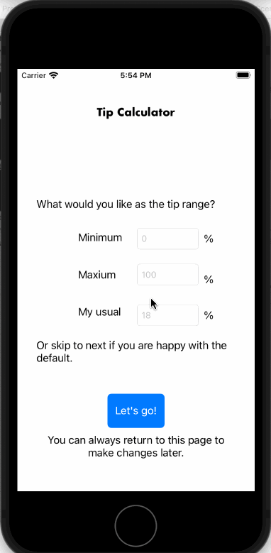

# Pre-work - *Tip Calculator*

**Tip Calculator** is a tip calculator application for iOS.

Submitted by: **Ou Stella Liang**

Time spent: **10** hours spent in total

## User Stories

The following **required** functionality is complete:

* [X] User can enter a bill amount, choose a tip percentage, and see the tip and total values.
* [X] User can select between tip percentages by tapping different values on the segmented control and the tip value is updated accordingly

The following **optional** features are implemented:

* [X] UI animations
* [ ] Remembering the bill amount across app restarts (if <10mins)
* [ ] Using locale-specific currency and currency thousands separators.
* [ ] Making sure the keyboard is always visible and the bill amount is always the first responder. This way the user doesn't have to tap anywhere to use this app. Just launch the app and start typing.

The following **additional** features are implemented:

- [X] Added a setup screen at startup where users can input min, max, default tip percentages
- [X] Replaced the segmented control with a slider
- [X] Automaticall calculates as soon as user finish input (tap elsewhere) with default tip percent, instead of having to activate the slider.
- [X] Added auto-layout constraints

## Video Walkthrough

Here's a walkthrough of implemented user stories with two screen sizes (iPhone SE 2nd gen and iPhone 12 pro)):

GIF created with [LiceCap](http://www.cockos.com/licecap/).

## Notes

I spent the most time understanding how to add an additional scene and passing values between view controllers. Setting up an additional swift file for the new view controller and keeping the custom class setup straight was a struggle and led to an hour of debugging the horrifying SIGABRT error. At one point I was using old code from various sources and at the end realizing the more simplified, up-to-date code was staring at me the entire time. 

I wrote a function for formatting text strings to currency format. Although it itself was working (evident in the placeholder $0.00 for bill amount), I couldn't figure out how to preserve the actual input amount once changing the .text attribute to the formatted despite trying different things.

Adjusting the auto-layout constraints was not as intuitive as moving components around on the screen. So that was a learning curve. 

My main takeaway is that taking the time to understand the documentation before haphazardly trying different solutions may be more efficient.

## License

    Copyright [2021] [Ou Stella Liang]

    Licensed under the Apache License, Version 2.0 (the "License");
    you may not use this file except in compliance with the License.
    You may obtain a copy of the License at

        http://www.apache.org/licenses/LICENSE-2.0

    Unless required by applicable law or agreed to in writing, software
    distributed under the License is distributed on an "AS IS" BASIS,
    WITHOUT WARRANTIES OR CONDITIONS OF ANY KIND, either express or implied.
    See the License for the specific language governing permissions and
    limitations under the License.
